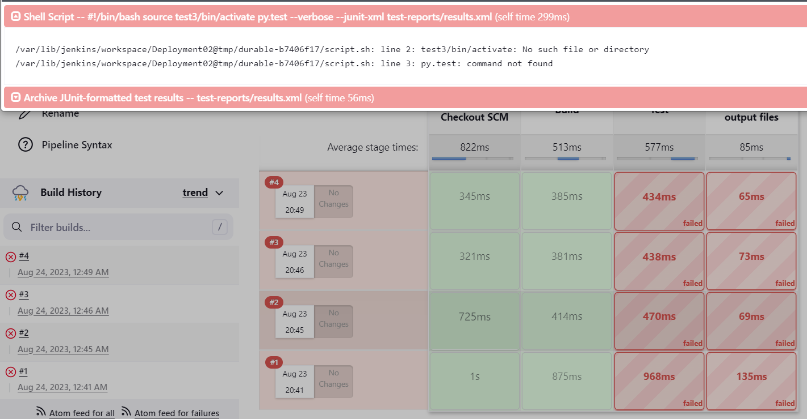
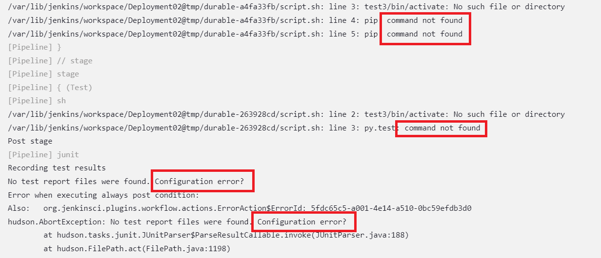
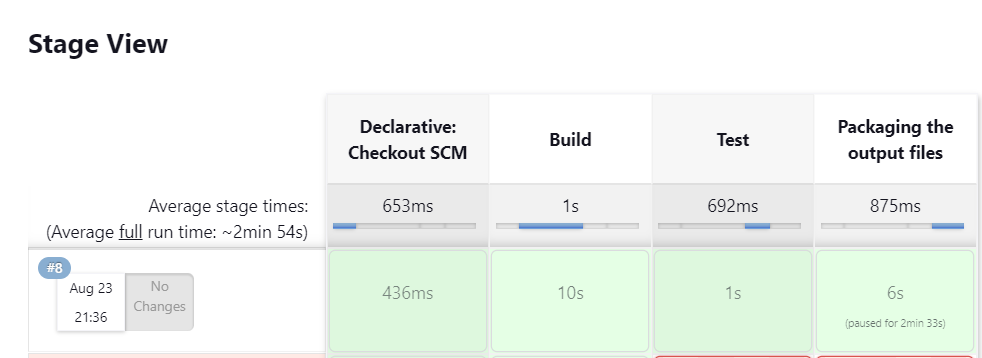
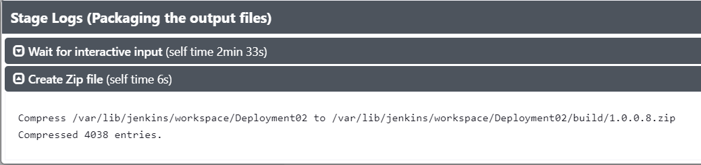
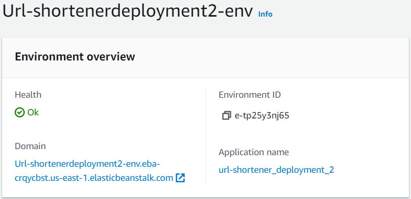
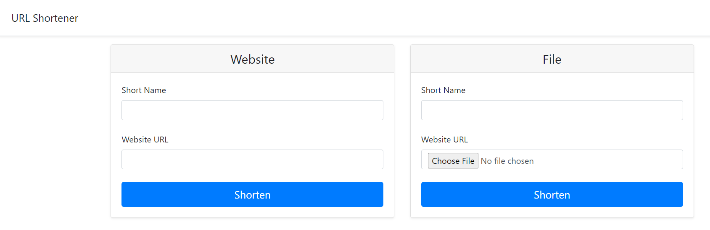

# Run a Jenkins Build and Manually Deploy a URL Shortner to Elastic Beanstalk

August 23, 2023

By:  Annie V Lam - Kura Labs

# Purpose
To build and test the URL shortener applicaition using Jenkins and deploy the URL shortener using Elastic Beanstalk.

Previously, an EC2 that already has Jenkins installed was used.  This deployment, a new EC2 server was created and Jenkins installed.

## Step #1 Map out the Deployment

[Deployment Flowchart](Images/Deployment_Pipeline.png)

## Step #2 Download Repository to GitHub

Github is the repository where Jenkins retrieve the files to build and test the application.  In order for the EC2, where Jenkins is installed, to get access to the repository a token needs to be generated from the GitHub and passed to the EC2s.

**Generate Token**

-     GitHub/Profile/Settings/Left Panel all the way on the bottom:  Developer Settings/Personal Access Tokens/Tokens (classic)/Generate New Token/Generate New Token (Claissic)/{Note:  Enter a note}/Check: Repo &  Admin:Repor_hook/Generate Token

## Step #3 and Step #4:  Use Jenkins to Auto Build and Auto Test Application

Jenkins is used to automate the Build, Test, and Zipping of the Application files that are need in the deployment stage.  To use Jenkins in a new EC2, all the proper installs to use Jenkins and to read the programing lanuague that the application is written in needs to be installed. In this case, they are Jenkins, Java, Python, and Jenkins additional plugin "Pipeline Utility Steps".

In Jenkins create a build "Deployment02" for the URL Shortner application from GitHub Repository https://github.com/LamAnnieV/Run_Jenkins_Build_and_Deploy_to_EB_Deployment02.git and run the build

### INSTRUCTIONS for INSTALLS for the Staging server ran Ubuntu OS in AWS

### BASH commands to install JAVA pacakage(s):
-   $sudo apt update   
-   $sudo apt-get install fontconfig openjdk-17-jre

### BASH commands to install JENKINS pacakage(s):  
Official Instaltion Instructions can be found here: https://pkg.jenkins.io/debian/
-   $curl -fsSL https://pkg.jenkins.io/debian/jenkins.io-2023.key | sudo tee /usr/share/keyrings/jenkins-keyring.asc > /dev/null
-   $echo deb [signed-by=/usr/share/keyrings/jenkins-keyring.asc] tps://pkg.jenkins.io/debian binary/ | sudo tee tc/apt/sources.list.d/jenkins.list > /dev/null
-   $sudo apt update
-   $sudo apt-get install jenkins
-   $sudo systemctl start jenkins
-   $sudo systemctl status jenkins

### BASH commands to install PYTHON pacakage(s):
-   $sudo apt update
-   $sudo apt install python3.10-venv

### Results

****The Build Stage was Successful, but not the Test Stage****

**Initial Analysis of Failure:**

-     The two errors are related to a file not found and a command not found.  The command is py.test, and py stands for python.  There might be an issue with the python install.

**Analysis:**
-     From the output file, pip and py.test commands are not found.  Both commands are related to Python

**Resolution:**

-     Reinstall Python in the Server, using the BASH commands to install PYTHON pacakage(s)

****Successful Build:****

****Confirmation Zip Files have been successfully generated:****

## Step #5:  Secure Copy URL Shortner Application Files from the Jenkins Server to local desktop to be uploaded to the Production Server.  

****Deploying the application that is from the Jenkins server will****
1.  Ensure the application being deployed is the same as the application that was built and tested in Jenkins
2.  If there are any issues with the deployment, there are test results from Jenkins that can be referenced

### Before secure copying the files from the virtual machine to the local machine, a SSH Tunnel is required

**How to create an SSH Tunnel**

1.  Get the public key from local machine
   
     In the local machine's command line:
    
-   $ssh-keygen
-   $cd path_where the id_rsa.pub_is_located
-   $cat id_rsa.pub
-   copy the public key
  
2.  Pass the key to the VM’s autherized_keys file

     In the Jenkins server command line:

-   $cd ~
-   $cd .ssh
-   $sudo nano authorized_keys
-   paste the puble key from your local machine in the authorized_keys file, save, and exit

**Windows Powershell command to secure copy files from a remote Ubuntu server to local machine via SSH tunnel** 

-   $scp ubuntu@insert_ip_address_here:insert_absolute_directory_path_here/insert_file_name_here_including_extention .
   

## Step #6:  Deploy Application to AWS ELASTIC BEANSTALK

**Create EC2 Role**

-     AWS/IAM/Roles/Create Role/Select:  AWS Service/[Use Case] Select:  EC2/Next
-     [Permissions Policies] Select:   "AWSElasticBeanstalkWebTier" & “AWSElasticBeanstalkWorkerTier”/Next
-     Role Name:  Elastic-EC2/Create Role

**Create EBS Role**

-     AWS/IAM/Roles/Create Role/Select:  AWS Service/[Use Case] Use Cases for other AWS services:  Elastic Beanstalk/Select:  Elastic Beanstalk - Customizable/Next
-     Next
-     Role Name:  aws-elasticbeanstalk-service-role/Create Role

**Deploy URL Shortner Application to Elastic Beanstalk**

-     AWS/Elastic Beanstalk/Environments/Create Environment/Application Name:/[Platform-4] Platform:  Python/Platform Branch:  Python 3.9 running on 64bit Amazon Linux 2023/Select:  Upload Your code/Version Label:  v#/Select: Local File/Choose File:  {files that were downloaded from the Jenkins Server, Unzipped, then rezipped}/Next
-     [EC2 instance profile] Select:  Elastic-EC2/Next
-     [Virtual Private Cloud] Select:  default VPC/[Instance Subnets] Select:  us-east-1a/Next
-     [Instances] Root Volume Type:  General Purpose (SSD)/Size:  10/[Capacity] Instance Types:  Deselect all & Select t2.micro/Next
-     Next
-     Submit
  
**Successful**

 
## Step #7:  Launch Website

            
## Areas for Optimization
-     Automate installs for Virtual Machines
-     Fully automate the Build and Test stage in Jenkins, from detecting an update in GitHub to sending the files to the Production Server+
-     Automate deploying the application to Production
  

  
